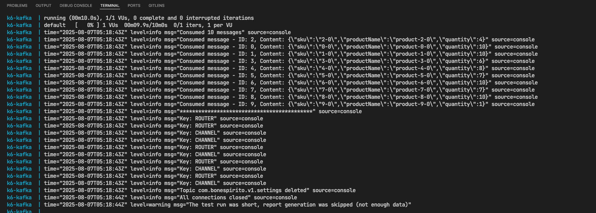
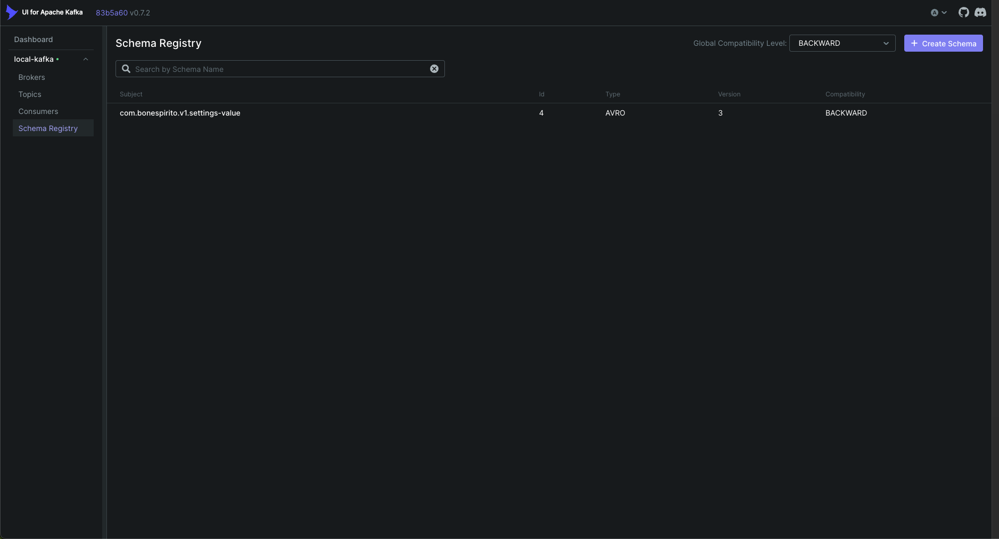
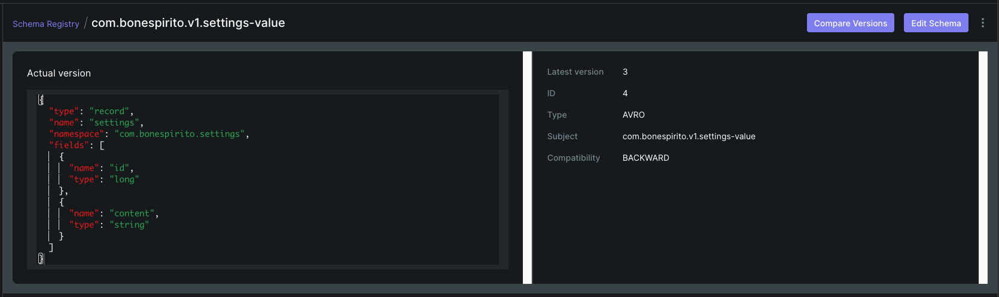
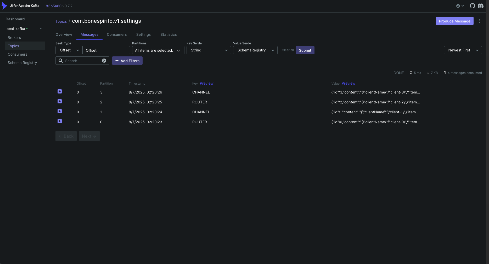
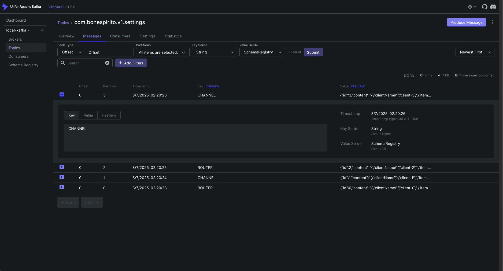
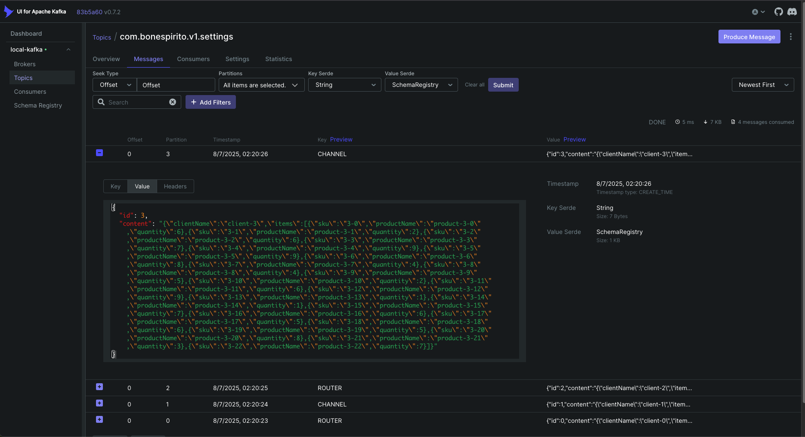

# Kafka Deserializer with Schema Registry

A demonstration project showcasing Apache Kafka integration with Confluent Schema Registry using k6 for load testing and performance validation.

## 📋 Table of Contents

- [Overview](#overview)
- [Architecture](#architecture)
- [Prerequisites](#prerequisites)
- [Quick Start](#quick-start)
- [Configuration](#configuration)
- [Testing](#testing)
- [Project Structure](#project-structure)
- [Troubleshooting](#troubleshooting)
- [Results of the Kafka Deserializer with Schema Registry](#results-of-the-kafka-deserializer-with-schema-registry)

## 🎯 Overview

This project demonstrates how to:
- Configure Kafka with Schema Registry for Avro serialization
- Implement producer/consumer patterns with schema validation
- Use k6 for Kafka load testing and performance monitoring
- Handle message keys and values with different serialization strategies

### Key Features

- **Avro Schema Management**: Centralized schema registry for message validation
- **Load Testing**: k6-based performance testing for Kafka producers/consumers
- **Docker Compose**: Complete containerized environment
- **Schema Evolution**: Support for schema versioning and compatibility
- **Monitoring**: Kafka UI for topic and message inspection

## 🏗️ Architecture

```
┌─────────────────┐    ┌─────────────────┐    ┌─────────────────┐
│   k6 Producer   │───▶│     Kafka       │◀───│ Schema Registry │
│                 │    │                 │    │                 │
│ - Message Gen   │    │ Topic:          │    │ - Avro Schemas  │
│ - Load Testing  │    │ com.bonespirito │    │ - Validation    │
│ - Validation    │    │ .v1.settings    │    │ - Versioning    │
└─────────────────┘    └─────────────────┘    └─────────────────┘
         │                       │                       │
         └───────────────────────┼───────────────────────┘
                                 │
                    ┌─────────────────┐
                    │   Kafka UI      │
                    │                 │
                    │ - Topic Monitor │
                    │ - Message View  │
                    │ - Consumer Mgmt │
                    └─────────────────┘
```

## 📋 Prerequisites

- **Docker**: Version 20.0+ with Docker Compose
- **Docker Compose**: Version 2.0+
- **Memory**: Minimum 4GB RAM available for containers
- **Ports**: Ensure ports 9092, 8081, 8080 are available

## 🚀 Quick Start

### 1. Start Infrastructure Services

Start Kafka, Schema Registry, and Kafka UI:

```shell
docker-compose -f docker-compose.yaml up --remove-orphans kafka-k6 kafka-ui-k6 schema-registry-k6
```

**Wait for services to be healthy** (approximately 30-60 seconds). You can monitor the startup in the logs.

### 2. Access Kafka UI (Optional)

Once services are running, access the Kafka UI at:
```
http://localhost:8080
```

### 3. Run k6 Load Tests

Execute the k6 Kafka performance tests:

```shell
docker-compose -f docker-compose.yaml up --build --remove-orphans k6-kafka
```

### 4. View Results

Test results are automatically saved to:
```
./kafka/results/
```

### 5. Cleanup

Stop all services:
```shell
docker-compose -f docker-compose.yaml down --remove-orphans
```

## ⚙️ Configuration

### Environment Variables

Configure the test behavior by modifying `kafka/utils/envs.js`:

```javascript
export const quantityOfMessages = __ENV.QUANTITY_OF_MESSAGES || "10";
export const topic = __ENV.TOPIC || "com.bonespirito.v1.settings";
export const brokers = (__ENV.BROKERS || "kafka-k6:9092").split(',');
export const registry = __ENV.SCHEMA_REGISTRY_URL || "http://schema-registry-k6:8081";
```

### Schema Configuration

The Avro schema is defined in `kafka/schemas/order-value.avsc`:

```json
{
  "type": "record",
  "name": "settings",
  "namespace": "com.bonespirito.settings",
  "fields": [
    { "name": "id", "type": "long" },
    { "name": "content", "type": "string" }
  ]
}
```

### Key Serialization

Keys alternate between 'ROUTER' and 'CHANNEL' using string serialization:

```javascript
key: schemaRegistry.serialize({
  data: index % 2 === 0 ? 'ROUTER' : 'CHANNEL',
  schemaType: SCHEMA_TYPE_STRING,
}),
```

## 🧪 Testing

### Test Scenarios

The k6 script (`kafka/k6-kafka.js`) includes:

1. **Message Production**: Generates messages with Avro-serialized values
2. **Message Consumption**: Validates consumed messages
3. **Schema Validation**: Ensures proper serialization/deserialization
4. **Performance Metrics**: Tracks produce duration and throughput

### Key Metrics

- **Produce Duration**: Time taken to produce messages
- **Consumer Lag**: Difference between produced and consumed messages
- **Schema Validation**: Success rate of serialization/deserialization
- **Message Integrity**: Validation of message content

### Custom Test Parameters

Modify test parameters via environment variables:

```shell
# Run with custom message count
QUANTITY_OF_MESSAGES=100 docker-compose up k6-kafka

# Run with different topic
TOPIC=my.custom.topic docker-compose up k6-kafka
```

## 📁 Project Structure

```
kafka-deserializer/
├── kafka/
│   ├── infra/
│   │   └── kafka-config.js      # Kafka connection configuration
│   ├── schemas/
│   │   └── order-value.avsc     # Avro schema definition
│   ├── utils/
│   │   ├── envs.js             # Environment variables
│   │   └── utils.js            # Utility functions
│   ├── results/                 # Test results output
│   └── k6-kafka.js             # Main k6 test script
├── docker-compose.yaml          # Docker services configuration
└── README.md                   # This documentation
```

## 🔧 Troubleshooting

### Common Issues

**Services not starting:**
```shell
# Check if ports are available
netstat -an | grep :9092
netstat -an | grep :8081
netstat -an | grep :8080

# Check container logs
docker-compose logs kafka-k6
docker-compose logs schema-registry-k6
```

**Schema registration failures:**
```shell
# Verify schema registry is accessible
curl http://localhost:8081/subjects

# Check schema format
cat kafka/schemas/order-value.avsc | jq .
```

**k6 test failures:**
```shell
# Check Kafka connectivity
docker-compose exec k6-kafka nc -zv kafka-k6 9092

# Verify schema registry connectivity
docker-compose exec k6-kafka nc -zv schema-registry-k6 8081
```

### Performance Tuning

For higher throughput testing:

1. **Increase message batch size** in `kafka-config.js`
2. **Adjust consumer group settings** for parallel processing
3. **Modify k6 VU configuration** in `k6-kafka.js`
4. **Increase Docker memory allocation**

### Monitoring

Monitor the system using:

- **Kafka UI**: http://localhost:8080
- **Container logs**: `docker-compose logs -f [service-name]`
- **k6 results**: Files in `./kafka/results/`

## 📚 Additional Resources

- [Apache Kafka Documentation](https://kafka.apache.org/documentation/)
- [Confluent Schema Registry](https://docs.confluent.io/platform/current/schema-registry/)
- [k6 Documentation](https://k6.io/docs/)
- [xk6-kafka Extension](https://github.com/mostafa/xk6-kafka)

---

**Note**: This project demonstrates a complete Kafka ecosystem with schema validation. It's designed for learning and testing purposes. For production use, consider additional security, monitoring, and scaling configurations.

# Results of the Kafka Deserializer with Schema Registry

Here we can see the messages produced and consumed by K6.



Here all schema value configuration



Detailed schema registry configuration



The topic `com.bonespirito.v1.settings`



The message with key content



Message with value content



Here we can see the `content` property as a serializable object inside the message.

With this material I want to evidence the use of the `schema-registry-k6` service to validate the message content and the `kafka-k6` service to produce and consume messages
and then we can see the example working without explicit key-schema configuration.